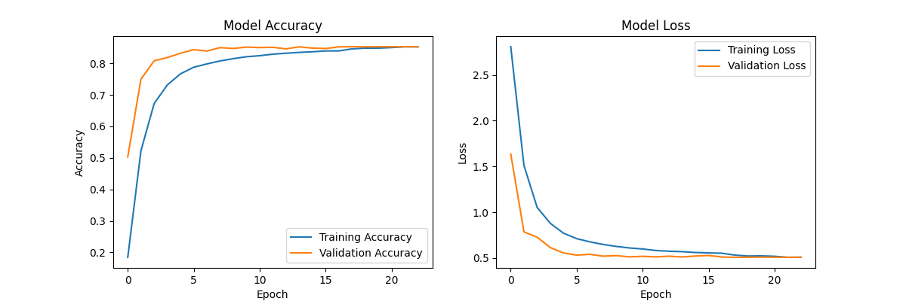

# Sign Language Recognition

A real-time sign language recognition system using TensorFlow, OpenCV, and MediaPipe.

## Features

- Real-time hand gesture recognition
- Support for American Sign Language alphabet (A-Z)
- Data collection mode for training
- CNN-based model with data augmentation
- Interactive webcam interface

## Training Results

The model's training history showing accuracy and loss over epochs:



## Setup

1. Clone the repository:
```bash
git clone https://github.com/yourusername/SignLanguage.git
cd SignLanguage
```

2. Create a virtual environment and activate it:
```bash
python -m venv venv
.\venv\Scripts\activate  # Windows
source venv/bin/activate  # Linux/Mac
```

3. Install dependencies:
```bash
pip install -r requirements.txt
```

## Usage

Run the program:
```bash
python app.py
```

### Controls
- Press 'c' to confirm a prediction and save the frame
- Press 'q' to quit the program

## Model Architecture

The system uses a CNN with:
- Multiple convolutional layers with batch normalization
- Residual connections
- Dropout for regularization
- Data augmentation during training

## Directory Structure

```
SignLanguage/
├── app.py              # Main application file
├── data/               # Training data directory
│   ├── A/             # Images for letter A
│   ├── B/             # Images for letter B
│   └── .../           # Other letters
├── images/            # Project images and plots
├── models/            # Saved models and training history
└── requirements.txt   # Project dependencies
``` 